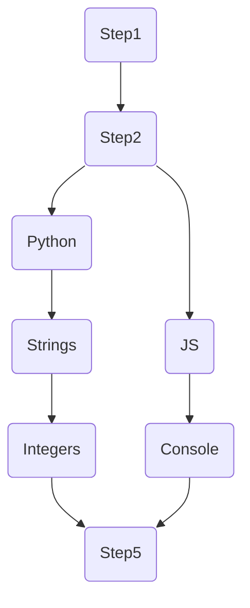

# Step

## Definition

```ts
type StepCat = "lesson" | "exercise" | "project";
type Step = {
  names: { [key: string]: string };
  tag: string;
  descriptions: { [key: string]: string };
  contents: { [key: string]: string }; // markdown is stored here
  category: StepCat;
  xp_award: number;
  coins_award: number;
  energy_cost: number;

  children: string[][]; // slice of slices of tags to other Steps
};
```

## Tree structure

> if you cant preview this, look it up on github or download a mermaid previewer extension

Suppose you have an adventure that looks like this



in (pseudo)code would be:

```go
// Adventure children:
[
    {"step1"},
    {
        "step2",
        children: [
            [
                "python", "strings", "integers"
            ],
            [
                "js", "console"
            ]
        ]
    }
    {"step5"}
]
```

## `GET ` /api/step/@{steptag}

You'll get all keys in Content, but to save space, values in the non current language will be omitted.
Please tell me if you're fine with this implementation! (i did it like this so you can still know what languages are available)

```ts
type Returns = {
    step: Step,
    langs: []string,
    local_content: {
        title: string,
        description: string,
        content: string,
    }
} | Error
```

## `POST` /api/step/@{steptag}

Modifiers: teacher

```ts
type Body = Step;
type Returns = Success | Error;
```

## `POST` /api/step/@{steptag}/complete

Sets the current step as completed on the user, awards coins and xp.
errors if the step doesn't exist or if it's already complete

```ts
type Returns = Success | Error;
```

## `GET ` /api/step/many

```ts
type Body = {
  items: string[]; // array of tags
};
type Returns = Step | Error;
```

## `POST` /api/step/new

Modifiers: teacher

```ts
type Body = {
  names: { [key: string]: string };
  descriptions: { [key: string]: string };
  contents: { [key: string]: string }; // markdown is stored here
  category: StepCat;
  xp_award: number;
  coins_award: number;
  energy_cost: number;

  parent?: `${"step:" | "adv:"}${string}`; // tag to parent (optional)
  // prefix with `step:` to add this step as a child of a step
  // prefix with `adv:` to add this step as a child of an adventure

  branch_index?: number; // the index of the branch to add the step to (optional)
  // only required for `step:`
  // if branch_index == len(parent.children): creates a new branch
  // if branch_index > len(parent.children): error
};

type Returns = Step | Error;
```
