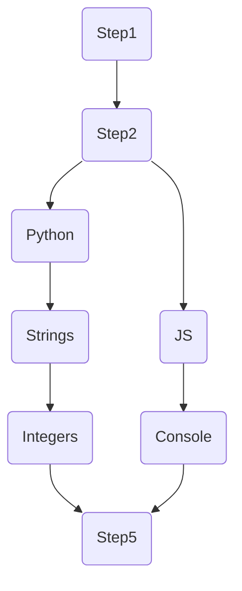

# Step
## Definition
```ts
type StepCat = "lesson" | "exercise" | "project"
type Step = {
    name: string;
    tag: string;
    description: string;
    content: string; // markdown is stored here
    category: StepCat;
    xp_award: number;
    coins_award: number;
    energy_cost: number;

    children: string[][]; // slice of slices of tags to other Steps
}
```

## Tree structure
> if you cant preview this, look it up on github or download a mermaid previewer extension

Suppose you have an adventure that looks like this

in (pseudo)code would be:
```go
// Adventure children:
[
    {"step1"},
    {
        "step2", 
        children: [
            [
                "python", "strings", "integers"
            ],
            [
                "js", "console"
            ]
        ]
    }
    {"step5"}
]
```


## `GET ` /api/step/@{steptag}
```ts
type Returns = Step | Error
```

## `POST` /api/step/@{steptag}
Modifiers: teacher
```ts
type Body = Step
type Returns = Success | Error
```

## `GET ` /api/step/many
```ts
type Body = {
    items: string[]; // array of tags
}
type Returns = Step | Error
```

## `POST` /api/step/new
Modifiers: teacher
```ts
type Body = {
    name: string;
    description: string;
    content: string;
    category: StepCat;
    xp_award: number;
    coins_award: number;
    energy_cost: number;

    parent?: string; // tag to parent (optional)
    branch_index?: number; // the index of the branch to add the step to (optional)
    // if branch_index == len(parent.children): creates a new branch
    // if branch_index > len(parent.children): error
}

type Returns = Step | Error
```